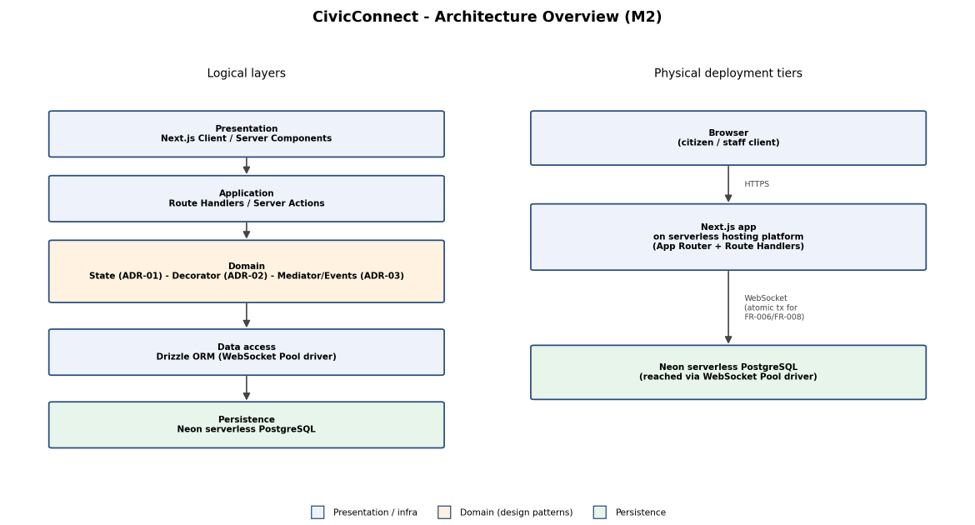

# System Architecture and Design

## High level architecture overview

Logical layers: Presentation (Next.js Client/Server Components) -\>
Application (Next.js Route Handlers / Server Actions) -\> Domain (State
pattern for the request lifecycle, Decorator pattern for audit logging,
in-process domain events for module decoupling) -\> Data access (Drizzle
ORM) -\> Persistence (Neon serverless PostgreSQL).

Physical deployment: Browser -\> Next.js application on a serverless
hosting platform -\> Neon PostgreSQL, reached over the Neon WebSocket
Pool driver so that FR-006/FR-008 can run as one atomic, interactive
transaction (status update + audit insert + optimistic-concurrency check
on a version column).

| Concern            | Technology                                                                           | Why (traces to)                                                                                                                                               |
|--------------------|--------------------------------------------------------------------------------------|---------------------------------------------------------------------------------------------------------------------------------------------------------------|
| Frontend + backend | Next.js 16 (App Router, Route Handlers), TypeScript, React 19                        | Single-language stack for a 3-person team; NFR-003 mobile-first, NFR-001 performance                                                                          |
| Database           | Neon serverless PostgreSQL (free tier)                                               | Cost/Resources constraint; scale-to-zero fits a student-project budget                                                                                        |
| ORM / DB access    | Drizzle ORM + drizzle-kit, @neondatabase/serverless WebSocket Pool driver            | SQL-level control, small serverless footprint; Pool driver required for the atomic FR-006/FR-008 transaction (HTTP driver cannot do interactive transactions) |
| Module decoupling  | In-process domain events (adapted from A2's Mediator/MediatR research to TypeScript) | ADR-03; avoids tight coupling between IssueManagement and RoutingAndAssignment without an external broker                                                     |

## Architecture Diagram

*Figure 1: CivicConnect logical layers (left) versus physical deployment
tiers (right). The two are kept distinct per the
proportional-architecture guidance: the logical view shows where the
State (ADR-01), Decorator (ADR-02) and Mediator/domain-event (ADR-03)
patterns sit in the domain layer, and the deployment view shows there
are only two physical tiers (serverless app, managed database) rather
than a distributed set of services, which the team's size and the ASRs
above do not justify.*

## Initial API / Integration Decision

The one module-to-module interaction that has reached a meaningful
design point so far is IssueManagementService notifying
RoutingAndAssignmentService when a new service request is logged, so
this is recorded now rather than left as an unstated assumption; other
integrations (e.g. any future external/public API) are not yet
established and are left as a forward engineering consideration (FEC)
instead of being invented here.

- Responsibilities and information exchanged: IssueManagementService
  raises an IssueCreatedEvent carrying the issue ID, category, GPS
  coordinates and urgency score; RoutingAndAssignmentService owns the
  handler that consumes it and performs GIS-boundary lookup and staff
  assignment.

- Mechanism: in-process Mediator / domain events (ADR-03), not a network
  API. A2 compared this against an asynchronous message broker and a
  synchronous REST call; both were rejected for M2 because a network
  boundary between two modules inside the same monolith is not justified
  by CivicConnect's current scale, and would add operational complexity
  (a broker to run, or a second HTTP contract to version) with no
  corresponding benefit yet.

- Validation / error behaviour: the handler currently runs synchronously
  in-process; a handler failure must roll back with the triggering
  database write rather than leaving an issue logged with no assignment
  attempted (see ADR-03 consequences on transactional handling).

- Security boundary: none required yet - the interaction never leaves
  the server process, so there is no network-facing surface to
  authenticate or authorise separately from the request that triggered
  it.

- Change/version implications: since this is in-process, there is no
  wire contract to version; if a future milestone moves
  RoutingAndAssignmentService out-of-process, this decision would need
  to be revisited and is noted as a forward engineering consideration
  rather than acted on now.

